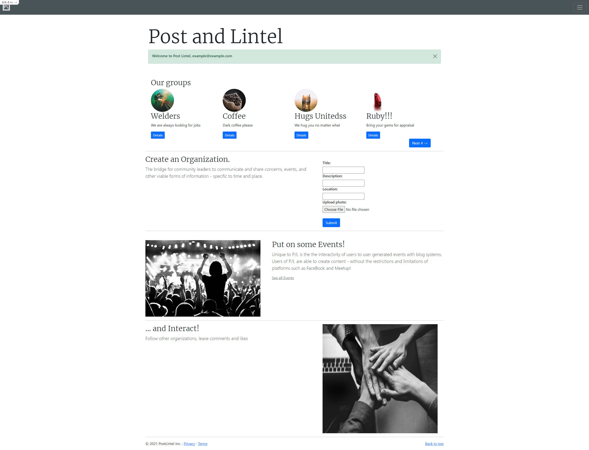
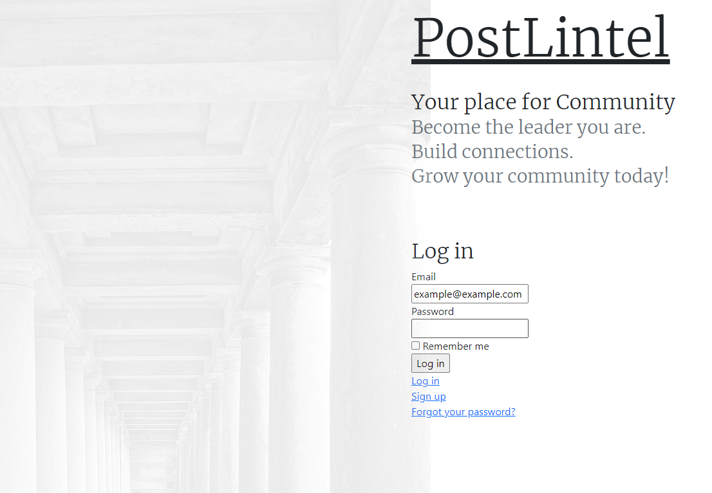
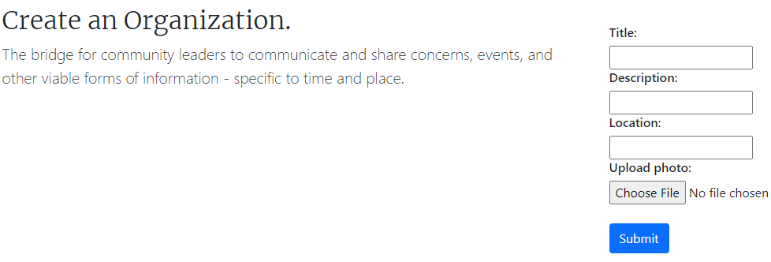
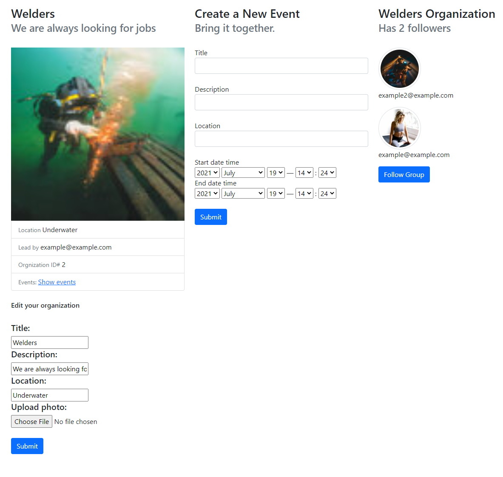
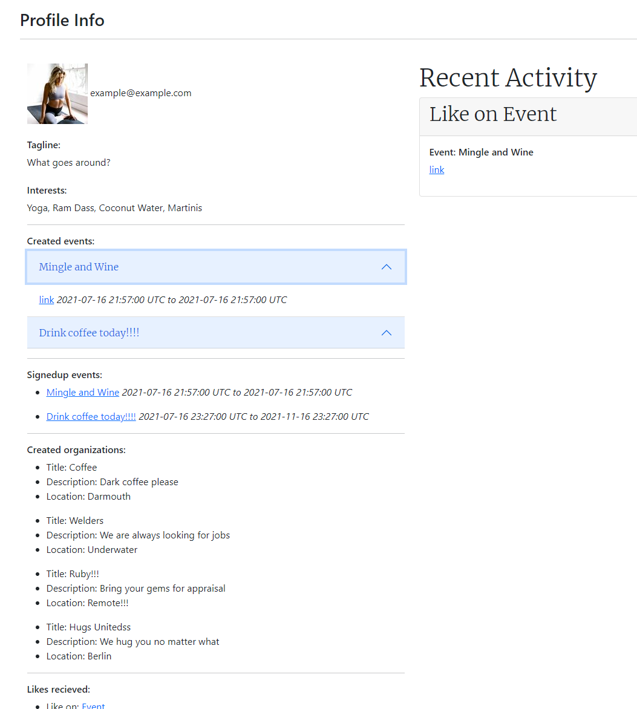

# Post and Lintel

_The community for communties..._ 

"_In architecture, post and lintel (also called prop and lintel or a trabeated system) is a building system where strong horizontal elements are held up by strong vertical elements with large spaces between them. This is usually used to hold up a roof, creating a largely open space beneath, for whatever use the building is designed. The horizontal elements are called by a variety of names including lintel, header, architrave or beam, and the supporting vertical elements may be called columns, pillars, or posts. The use of wider elements at the top of the post, called capitals, to help spread the load, is common to many traditions._" 

_-_ wikipedia

## Technologies

- Bootstrap
- Ruby on Rails
- Popper.JS
- Pg (Postgresql)
- Devise
- image_processing
- image_magick

## Overview

**Preview PL**
[link](https://postandlintel.herokuapp.com/)

PL (Post and Lintel) is a portal for community leaders - allowing short and long posts, and events. The bridge for community leaders to communicate and share concerns, events, and other viable forms of information - specific to time and place.

Unique to P/L is the the interactivity of users to user generated events with blog systems. Users of P/L are able to create content - without the restrictions and limitations of such platforms as FaceBook and Meetup!

## Features

* Manage your organization and events: gain followers, promote events, have attendees
* Email event attendees: send an initial e-mail 
* Interaction with attendees and other community members: comments, likes and follows
* Profiles: see the activity - such as likes, comments, and event signups - on their profile page

## How to Use Post and Lintel

### Create an account

### Create and organization

### Throw some events

### Communicate with other members

